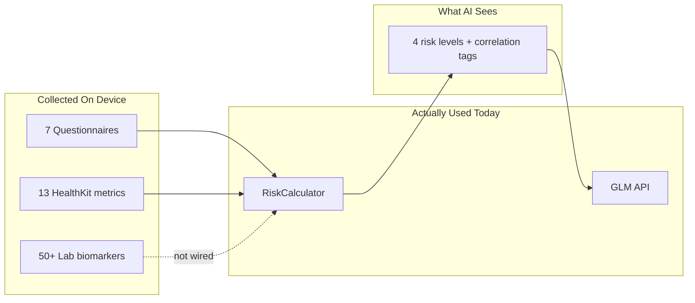
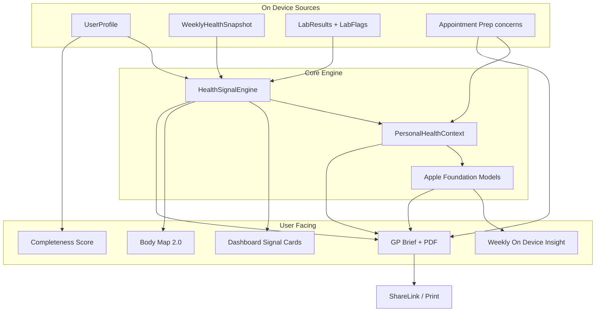

# Hackathon Differentiation Strategy for HealthLongi

## The core problem

You built a **rich data collector** with a **thin inference layer**:



**Key files:** [`AssessmentInput.swift`](HealthLongi/Core/Models/AssessmentInput.swift), [`AbstractedRiskProfile.swift`](HealthLongi/Core/Models/AbstractedRiskProfile.swift), [`UserProfile.swift`](HealthLongi/Core/Models/UserProfile.swift), [`GLMPrompts.swift`](HealthLongi/Features/AI/GLMPrompts.swift)

**Hackathon pitch:** *"We fuse wearable data, validated screening, and lab OCR into on-device health signals and a GP-ready brief — Apple Intelligence explains your data on your phone; it never diagnoses."*

---

## Scope (confirmed features only)

### Tier A

| # | Feature | Role |
|---|---------|------|
| **1** | GP Visit Brief | Flagship export — PDF/share for clinicians |
| **2** | Health Signal Engine | On-device inference layer (detailed below) |
| **3** | Personal Health Context (PHC) | Local AI profile document (detailed below) |
| **4** | Appointment Prep Mode | User picks concerns → brief focuses those sections |

### Tier B

| # | Feature | Role |
|---|---------|------|
| **6** | Body Map 2.0 | Visualise Health Signals per body region |
| **7** | Screening Completeness Score | Drive Assess hub engagement |

### Tier C — Apple Intelligence (on-device inference)

Replace cloud-heavy inference with **Apple Foundation Models** (`SystemLanguageModel` / Foundation Models framework) for all new AI features. Raw health data stays on-device; GLM remains optional for the existing short dashboard summary only.

**Requirements:**
- iPhone 15 Pro or newer (A17 Pro+) / iPad with M-series for full model access
- iOS 26+ deployment target (matches project)
- Graceful fallback: template strings when Apple Intelligence unavailable (simulator, older devices)
- No API keys, no network, no usage limits for on-device path

**What Apple Intelligence does in this app:**
- Explain Health Signals in plain English (citing evidence from PHC)
- Generate neutral "questions for your GP" from signals
- Weekly "Your week in health" reflection card
- **Does not:** name diseases, suggest medications, or override rule-based severity

---

## Architecture



---

## Feature 2 (Tier A): Health Signal Engine — deep dive

### What it is

A **deterministic, on-device rule engine** that reads all your collected data and produces structured `HealthSignal` objects. This is the inference layer you are missing today — it turns raw inputs into *discussion topics*, not diagnoses.

**Why it matters:** Judges can see you are not just collecting data. Every signal is traceable to evidence the user entered. Apple Intelligence then *phrases* signals; it does not invent them.

### Data flow

1. **Collect** — `UserProfile`, `WeeklyHealthSnapshot`, `LabResults`, prior-week HealthKit deltas
2. **Flag labs** — compare values to NHS reference ranges in [`LabBiomarkerCatalog`](HealthLongi/Core/Resources/LabBiomarkerCatalog.swift) (extend with `referenceRange` struct)
3. **Evaluate rules** — cross-domain conditions (see table below)
4. **Deduplicate & rank** — max 5 active signals; `discussWithGP` surfaces first
5. **Persist** — write to `PersonalHealthContext.activeSignals`
6. **Explain** — Apple Intelligence generates human-readable `detail` from signal + evidence (optional; template fallback)

### Model

```swift
struct HealthSignal: Identifiable, Codable, Sendable {
    enum Kind { case correlation, trend, screening, labFlag, lifestyle }
    enum Severity { case info, watch, discussWithGP }

    var id: String
    var kind: Kind
    var title: String
    var detail: String              // template or Apple Intelligence output
    var evidence: [EvidenceItem]    // traceable source
    var suggestedQuestions: [String] // flows to GP Brief
    var severity: Severity
    var bodyRegion: BodyRegion?     // for Body Map 2.0
    var createdAt: Date
}

struct EvidenceItem: Codable, Sendable {
    enum Source { case healthKit, questionnaire, lab, userInput }
    var source: Source
    var label: String    // "GAD-7 score"
    var value: String    // "12 (moderate)"
    var recordedAt: Date?
}
```

### Rule catalog (initial set)

| Signal ID | Trigger | Severity | Body region |
|-----------|---------|----------|-------------|
| `metabolic_lifestyle` | HbA1c ≥ 6.0% + steps < 5000 + BMI ≥ 25 | discussWithGP | abdomen |
| `stress_somatic` | PSS-10 ≥ 20 + PHQ-15 ≥ 10 | watch | head |
| `alcohol_mood` | AUDIT-C ≥ 5 + PHQ-9 ≥ 10 | discussWithGP | abdomen |
| `recovery_concern` | RHR up ≥10% vs prior week + sleep < 6h | watch | heart |
| `lipid_flag` | LDL above NHS desirable | discussWithGP | heart |
| `wellbeing_dip` | WHO-5 raw ≤ 12 | watch | brain |
| `activity_mood` | Steps down >20% + GAD-7 ≥ 10 | watch | legs |
| `sleep_anxiety` | Sleep < 6h + GAD-7 ≥ 10 | watch | brain |
| `bp_elevated` | Systolic ≥ 140 or diastolic ≥ 90 (lab or manual) | discussWithGP | heart |
| `vitamin_d_low` | Vitamin D below deficient threshold | watch | wholeBody |

Rules live in `Services/Inference/HealthSignalEngine.swift`. Extend existing [`RiskCalculator.detectCorrelations`](HealthLongi/Features/Scoring/RiskCalculator.swift) patterns — do not replace RiskCalculator; signals are a parallel, richer layer.

### UI

- **Dashboard** — "Health Signals" section below domain cards; severity chips (info / watch / discuss with GP)
- **Tap signal** — evidence sheet listing every source field
- **Empty state** — "Complete more assessments to unlock personalised signals"

### Relationship to Apple Intelligence

Apple Intelligence **never runs the rules**. It only receives a `HealthSignal` + `EvidenceItem[]` and returns ≤80 words of plain-English explanation. If the model output contains banned patterns (diagnosis words, drug names), discard and use template.

---

## Feature 3 (Tier A): Personal Health Context (PHC) — deep dive

### What it is

A **structured, evolving on-device document** — your "local AI profile". It is not a chatbot memory or a medical record. It is a snapshot of what the app knows about you right now, built from rules and your data, that Apple Intelligence reads to give useful insights without sending anything to the cloud.

**Why it matters:** Today GLM receives only 4 abstract risk levels. PHC gives on-device AI the full *structured* picture while keeping raw values on the phone. It is the bridge between "we collect everything" and "AI is actually useful."

### What goes in PHC

```swift
struct PersonalHealthContext: Codable {
    var lastUpdated: Date
    var activeSignals: [HealthSignal]
    var screeningSnapshot: [ScreeningSnapshot]
    var lifestyleSnapshot: LifestyleSnapshot
    var labFlags: [LabFlag]
    var appointmentPrep: AppointmentPrepContext?
    var weeklyInsightHistory: [WeeklyInsight]   // last 8 weeks, on-device only
    var completenessScore: Int                    // 0–100, Tier B #7
}

struct ScreeningSnapshot: Codable {
    var tool: String       // "PHQ-9"
    var score: Int
    var band: String       // "mild" — validated label, not diagnosis
    var completedAt: Date
}

struct LifestyleSnapshot: Codable {
    var stepsAvg: Int?
    var sleepHoursAvg: Double?
    var restingHRAvg: Double?
    var hrvAvg: Double?
    var bmi: Double?
    var exerciseMinutesWeek: Int?
    var syncedAt: Date?
}

struct AppointmentPrepContext: Codable {
    var selectedConcerns: [ConcernTopic]  // mood, heart, metabolism, labs, sleep
    var freeTextReason: String?
    var preparedAt: Date
}

struct WeeklyInsight: Codable {
    var weekStarting: Date
    var summaryMarkdown: String   // Apple Intelligence or template
    var signalIDs: [String]       // which signals were active that week
}
```

### When PHC updates

| Event | Action |
|-------|--------|
| App open + HealthKit refresh | Rebuild `lifestyleSnapshot` |
| Questionnaire completed | Update `screeningSnapshot` entry |
| Lab import / manual edit | Recompute `labFlags`, re-run signal engine |
| Signal engine run | Replace `activeSignals` |
| Appointment Prep saved | Store `appointmentPrep` |
| Sunday (or first open each week) | Generate new `WeeklyInsight` via Apple Intelligence |

### Storage

Persist as JSON on `UserProfile` (same pattern as `labResultsData`) or new SwiftData model. Never sync to cloud.

### What Apple Intelligence reads from PHC

**Input (structured JSON, on-device only):**
- Top 3 active signals with evidence
- Screening bands (not raw answers to individual questions)
- Lifestyle averages
- Lab flags (biomarker name + "above/below reference" — not full panel unless GP export)
- User's appointment prep concerns

**Output use cases:**

| Use case | Where shown | Constraints |
|----------|-------------|-------------|
| Signal explanation | Signal detail sheet | Cite evidence; max 80 words |
| Weekly insight | Dashboard card | Max 120 words; 2 paragraphs |
| GP questions | GP Brief section 6 | 3–5 neutral questions |
| Appointment focus line | GP Brief section 1 | One sentence from user's concerns |

**Prompt guardrails (system prompt for Apple Intelligence):**
- Plain English, NHS-friendly tone
- Never name diseases or conditions
- Never recommend medications or doses
- Use "consider discussing with your GP" for `discussWithGP` signals only
- Only reference facts present in the provided JSON
- If unsure, say "your recorded data suggests this may be worth discussing"

### PHC vs GLM (cloud)

| | PHC + Apple Intelligence | GLM (existing) |
|--|---------------------------|----------------|
| Data | Full structured PHC on-device | `AbstractedRiskProfile` only |
| Network | None | Required |
| Use | Signals, weekly insight, GP questions | Short dashboard summary |
| Privacy | Raw values never leave phone | Anonymised bands only |

Keep GLM as optional fallback for dashboard summary; all new features use PHC + Apple Intelligence.

---

## Feature 1: GP Visit Brief

**Entry point:** Prominent card on [`ProfileSummaryView`](HealthLongi/Features/Onboarding/ProfileSummaryView.swift) — *"Prepare for GP Visit"*.

**Flow:**
1. Disclaimer: *"Summary for discussion — not a diagnosis."*
2. **Appointment Prep (Tier A #4):** pick 2–3 concerns (mood / heart / metabolism / labs / sleep) + optional free-text reason
3. Preview sheet → Share PDF / Print / Copy

**PDF sections:**

1. Reason for visit (from Appointment Prep)
2. Key discussion topics (from HealthSignalEngine, filtered by selected concerns)
3. Validated screening scores with dates (all 7 questionnaires if completed)
4. Physical measures (4-week HealthKit averages)
5. Lab results — **out of range only**, expand to full panel
6. Suggested questions for GP (Apple Intelligence from PHC, template fallback)
7. Data sources and limitations

**Lab UX:** Default collapsed abnormal-only; "Show all labs" expand. Reference ranges from extended `LabBiomarkerCatalog`.

**Files to add:**
- `Features/GPBrief/GPVisitBriefView.swift`
- `Features/GPBrief/AppointmentPrepView.swift`
- `Features/GPBrief/GPBriefBuilder.swift`
- `Features/GPBrief/GPBriefPDFRenderer.swift`
- `Core/Models/GPVisitBrief.swift`

---

## Feature 4: Appointment Prep Mode

Lightweight flow embedded in GP Brief entry (not a separate tab):

- Multi-select chips: Mood · Heart · Metabolism · Labs · Sleep
- Optional text field: "What would you like to discuss?"
- Selections saved to `PersonalHealthContext.appointmentPrep`
- GP Brief **reorders and filters** sections: e.g. if "Mood" selected, screening scores and mood-related signals appear first
- Dashboard can show a subtle banner: "GP visit prepared — tap to review brief"

---

## Tier B #6: Body Map 2.0

Upgrade [`BodyMapView`](HealthLongi/Features/BodyMap/BodyMapView.swift) to colour regions from **HealthSignals**, not just PHQ-9/GAD-7:

| Region | Signal sources |
|--------|----------------|
| Brain | PHQ-9, GAD-7, WHO-5, sleep, PSS-10 |
| Heart | RHR, HRV, lipids, BP, cardio risk |
| Lungs | SpO₂, PSS-10 (stress-breathing link) |
| Abdomen | HbA1c, waist, BMI, PHQ-15, AUDIT-C |
| Joints / limbs | Steps, activity, PHQ-15 |

Region colour = highest severity among mapped signals. Tap region → list signals + link to relevant questionnaire or HealthKit detail.

Update [`BodyRegionMapping.swift`](HealthLongi/Features/BodyMap/BodyRegionMapping.swift) to consume `HealthSignal.bodyRegion`.

---

## Tier B #7: Screening Completeness Score

**Formula (example weights):**

| Source | Weight | Complete when |
|--------|--------|---------------|
| PHQ-9 + GAD-7 | 25% | Both completed |
| WHO-5 + PSS-10 | 15% | Both completed |
| AUDIT-C + PHQ-15 | 10% | Both completed |
| HealthKit core (steps, sleep, RHR) | 20% | All 3 available |
| Lab basic panel (≥5 biomarkers) | 15% | Threshold met |
| Demographics | 15% | Onboarding done |

**UI:**
- Assess hub header: progress ring + "Your health picture is 62% complete"
- Tapping opens checklist of missing items with deep links
- Score stored on `PersonalHealthContext.completenessScore`
- GP Brief footer: "Data completeness: 62% — some sections may be empty"

---

## Apple Intelligence integration

**New service:** `Services/AI/OnDeviceHealthAIService.swift`

```swift
protocol OnDeviceHealthAIProviding {
    func explainSignal(_ signal: HealthSignal) async -> String
    func generateWeeklyInsight(from context: PersonalHealthContext) async -> String
    func suggestGPQuestions(from context: PersonalHealthContext) async -> [String]
}
```

**Implementation:**
1. Check `SystemLanguageModel.default.isAvailable`
2. Build prompt from PHC JSON + strict system guardrails
3. Post-process output with `AISafetyFilter` (regex for diagnosis/drug patterns)
4. Fallback to templates in `OnDeviceHealthAITemplates.swift`

**Simulator / older devices:** Always use templates; no crash, no blocking.

---

## AI safety framework

1. **Layer separation:** Rules → signals → Apple Intelligence phrasing (AI never invents clinical facts)
2. **Banned output filter:** Post-process for diagnosis patterns, drug names, "you have…"
3. **Disclaimers:** Every export + AI card: *"Not a substitute for professional medical advice"*
4. **Evidence citations:** Every signal links to source data
5. **GP escalation:** `discussWithGP` severity + validated screen thresholds only
6. **Genetics in export:** Label as *"family history / demo — not a genetic test"*
7. **Consent sheet** before first PDF share

---

## Build order

1. `LabBiomarker.referenceRange` + `LabFlag`
2. `HealthSignalEngine` + Dashboard signal cards
3. `PersonalHealthContext` model + rebuild on data events
4. `OnDeviceHealthAIService` (Apple Intelligence + templates)
5. Appointment Prep + GP Brief builder + PDF + Profile entry
6. Body Map 2.0 wiring
7. Screening Completeness Score

---

## Demo script (3 minutes)

1. **Problem:** "GPs have 10 minutes. Patients forget scores and lab numbers."
2. **Import:** Scan lab PDF (on-device OCR)
3. **Assess:** Complete PHQ-9; completeness score rises
4. **Insight:** Dashboard shows Health Signals; Body Map colours update
5. **Apple Intelligence:** Tap signal — on-device explanation with evidence
6. **Payoff:** Profile → Appointment Prep (select Mood + Labs) → GP Brief PDF → share
7. **Close:** "Rules find the signals. Apple Intelligence explains them. Nothing leaves your phone."
